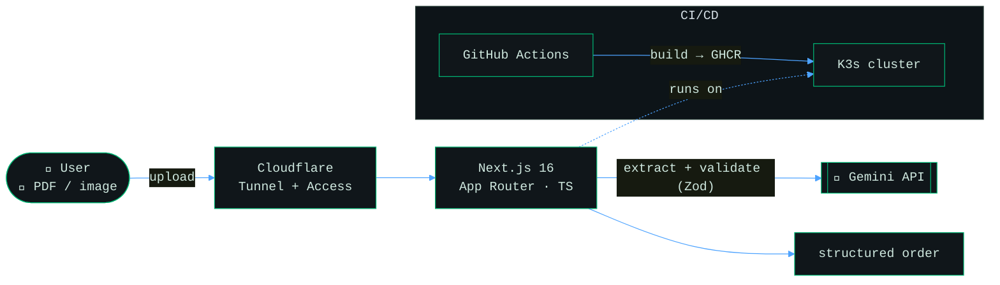
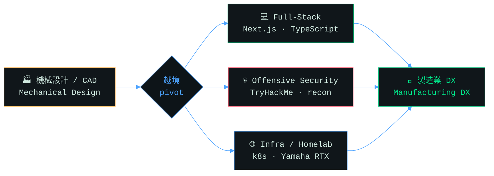

<!-- ============================================================
  FumiakiC / profile README — rev B (refactored)

  MAINTENANCE NOTES
  - Theme switching: every visual asset is wrapped in <picture> with a
    prefers-color-scheme source. Edit BOTH variants or regenerate the
    light one from the dark source (palette block swap only).
  - No numbers are hardcoded that can go stale. Live data comes from:
    TryHackMe badge (S3), github-readme-stats, streak-stats, snake Action.
  - assets/header-*.svg + assets/tagline-*.svg are self-hosted (no
    external typing-SVG service). Animations respect
    prefers-reduced-motion.
  - snake-*.svg is generated by .github/workflows/snake.yml onto the
    `output` branch. Requires Actions "Read and write" permission.
============================================================ -->

<!-- ============ SECTION: header (self-hosted animated SVG) ============ -->
<picture>
  <source media="(prefers-color-scheme: dark)" srcset="./assets/header-dark.svg" />
  
</picture>

<picture>
  <source media="(prefers-color-scheme: dark)" srcset="./assets/tagline-dark.svg" />
  
</picture>

 

---

## `> whoami --verbose`

昼は**機械設計エンジニア**（歴史ある製造業）、夜と週末は**フルスタック開発**と**攻撃的セキュリティ**の沼にいる人。
現場の製造ドメイン知識を武器に、業務ソフトを一人で作って回しながら、**製造業のDX** に越境しようとしています。

> A mechanical design engineer who ships production software solo, then breaks into systems on weekends (legally\*). Currently escaping the drafting board toward **manufacturing DX** — one PR, one writeup, one over-engineered homelab at a time.

<code>$ cat ~/.about &nbsp;# the honest long version</code>

 

- 🏭 **Day job:** Mechanical design engineer at a traditional Japanese manufacturer. I know why the tolerance stack-up matters — and now I know why the build pipeline is red.
- 🎓 **Origin story:** Graduate research background with peer-reviewed publications in mechanical engineering. Turns out `git rebase` is scarier than any FEA convergence failure.
- 🧑‍💻 **The pivot:** Building internal tools end-to-end (front-end, back-end, infra, security) because someone had to, and that someone owns the on-call phone.
- 🕳️ **The rabbit hole:** A near-unbroken daily streak on <a href="https://tryhackme.com/p/Fumiaki">TryHackMe</a>. Somewhere between "I totally get subnetting" and "why is it always DNS."
- ☕ **Fuel:** Caffeine. Occasionally food.

\* legally. probably. I read the scope doc. mostly.

---

<!-- ============ SECTION: projects ============ -->
## `> ls ./projects`

<table>
<tr>
<td width="50%" valign="top">

### 📦 [chumon-hub](https://github.com/FumiakiC/chumon-hub)
**AI order-management system.** Upload a messy PDF/image order form, and a "sophisticated pipeline" quietly hands the hard part to Gemini and gets back clean, structured data.

</td>
<td width="50%" valign="top">

### 🎭 [ppt-orchestrator](https://github.com/FumiakiC/ppt-orchestrator)
**Zero-dependency PowerPoint web remote.** Switch between speakers' decks from your phone — no Node, no Python, nothing to install on a locked-down corporate PC. Born from being "the guy who switches the slides."

</td>
</tr>
</table>

<code>$ cat chumon-hub/ARCHITECTURE.md &nbsp;# how the order flows</code>

 

No open ports — everything rides a Cloudflare Tunnel, and Access restricts it to allow-listed emails. The app never touches the raw internet.

<code>$ cat ppt-orchestrator/FEATURES.md &nbsp;# why it refuses to crash</code>

 

- 🔐 **Dynamic 6-digit PIN** generated on the host — only staff get in.
- 🔄 **Never-crash polling** — venue Wi-Fi drops? Broken pipes and client disconnects are swallowed; the web UI auto-reconnects.
- 🧟 **Zombie-proof lifecycle** — Win32 Job Objects make sure PowerPoint dies when it should.
- 🛡️ **Self-cleaning** — the launcher elevates, sets firewall + URLACL rules, then removes them on exit.
- 🚫 **Zero third-party installs** — pure PowerShell + Batch. Works on the strictest corporate PC.

---

<!-- ============ SECTION: skills ============ -->
## `> cat skills.txt`

**💀 Breaking &amp; entering** *(security / infra — "for research")*

**🧙 Actually shipping** *(dev)*

**🏠 The homelab** *(a data center + a terrifying power bill)*

---

<!-- ============ SECTION: career map (mermaid renders live on GitHub) ============ -->
## `> traceroute career`

---

<!-- ============ SECTION: live stats (theme-aware) ============ -->
## `> systemctl status github`

<picture>
  <source media="(prefers-color-scheme: dark)" srcset="https://github-readme-stats.vercel.app/api?username=FumiakiC&show_icons=true&hide_border=true&count_private=true&include_all_commits=true&bg_color=0a0e0f&title_color=00ff9c&text_color=cfe8df&icon_color=4da3ff&ring_color=00ff9c" />
  
</picture>
<picture>
  <source media="(prefers-color-scheme: dark)" srcset="https://github-readme-stats.vercel.app/api/top-langs/?username=FumiakiC&layout=compact&hide_border=true&langs_count=8&bg_color=0a0e0f&title_color=00ff9c&text_color=cfe8df" />
  
</picture>

 

<picture>
  <source media="(prefers-color-scheme: dark)" srcset="https://streak-stats.demolab.com/?user=FumiakiC&hide_border=true&background=0a0e0f&stroke=17342c&ring=00ff9c&fire=ffb454&currStreakLabel=00ff9c&sideLabels=cfe8df&dates=5c7a72&currStreakNum=cfe8df&sideNums=cfe8df" />
  
</picture>

 

<picture>
  <source media="(prefers-color-scheme: dark)" srcset="https://github-readme-activity-graph.vercel.app/graph?username=FumiakiC&bg_color=0a0e0f&color=cfe8df&line=00ff9c&point=4da3ff&area=true&hide_border=true" />
  
</picture>

<!-- snake needs .github/workflows/snake.yml to have run once (output branch) -->
<picture>
  <source media="(prefers-color-scheme: dark)" srcset="https://raw.githubusercontent.com/FumiakiC/FumiakiC/output/snake-dark.svg" />
  
</picture>

---

<!-- ============ SECTION: contact ============ -->
## `> cat contact.md`

Got a manufacturing process begging to be automated, a CTF to lose sleep over, or just want to argue about tabs vs spaces (it's spaces)?

  

<i>Still learning how to exit Vim. Send help. — <code>root@FumiakiC:~#</code> ▮</i>

